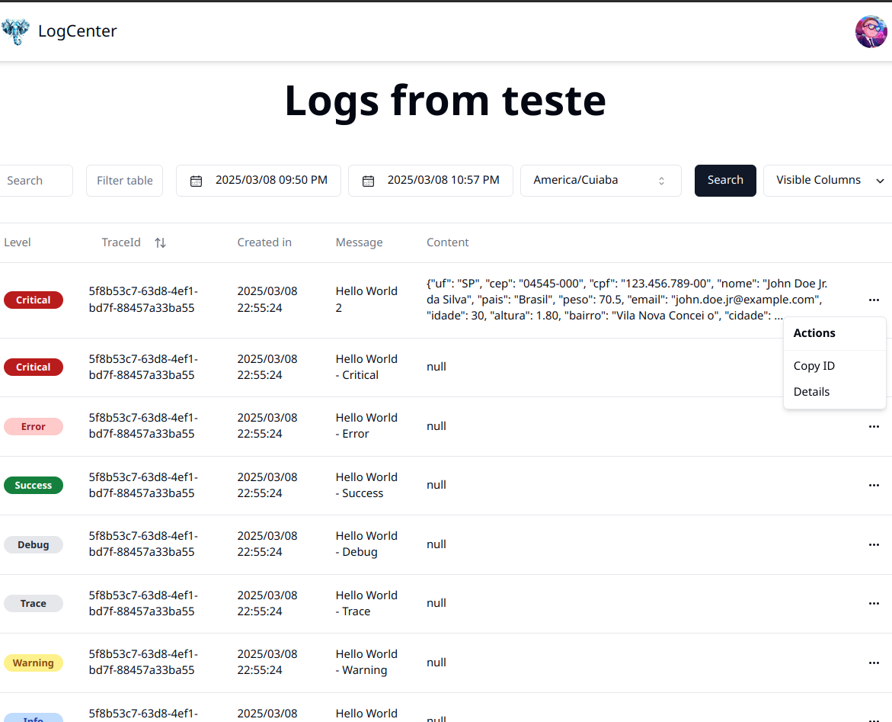
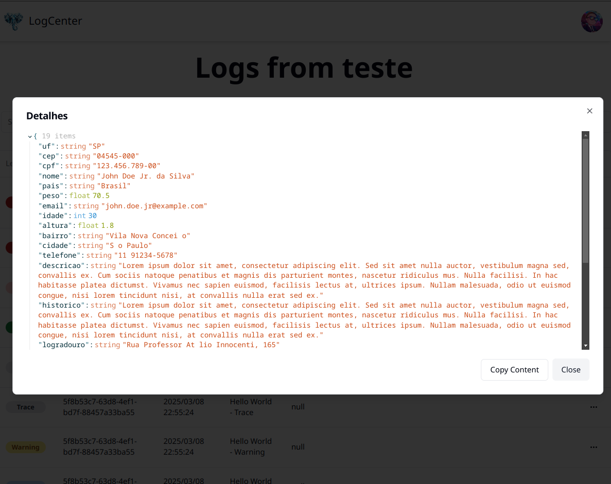
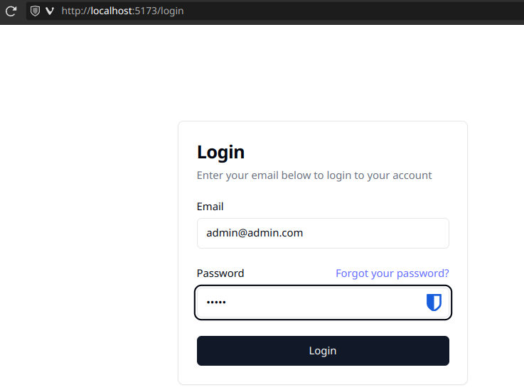
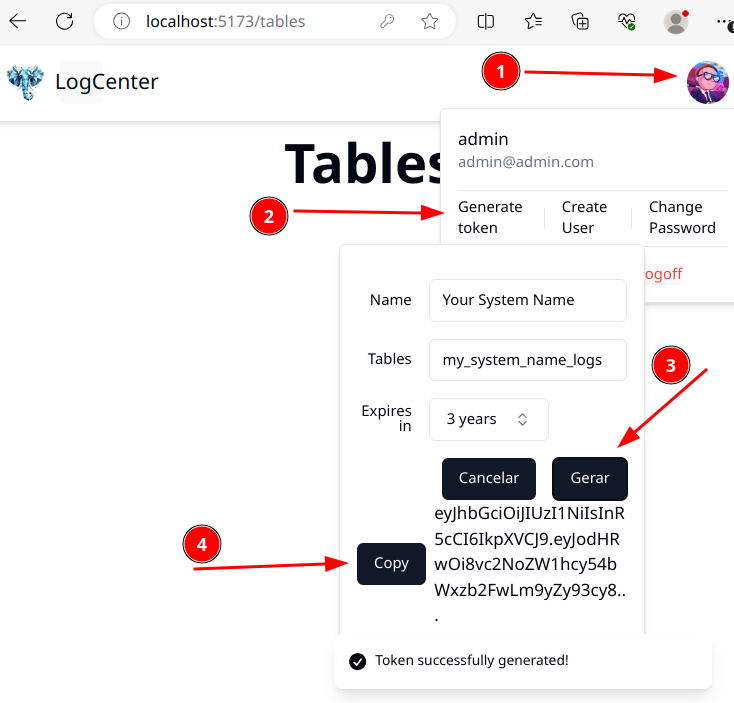

# LogCenter  
<p align="center">
  
</p>


`LogCenter` is a custom solution for log store and querying, debug and audit log, similar to ElasticSearch — which is widely used for storing, searching, but not analyzing data logs (yet). However, LogCenter utilizes PostgreSQL as the underlying database for storing and querying logs.  

The main functionality is to provide a robust and efficient way to store and query logs, making it easier to debug and troubleshoot applications.


In `Details` you can see whole object that you sent.


# Getting Started

Download the `start.sh` script and `.env` file with command:
```bash
wget hhttps://raw.githubusercontent.com/hudsonventura/LogCenter/refs/heads/main/start.sh && wget https://raw.githubusercontent.com/hudsonventura/LogCenter/refs/heads/main/.env
```

Edit the `.env` file as you want. You can keep it is, it will work that way.
```
LOGCENTER_API_PORT=9200
LOGCENTER_INTERFACE_PORT=5173

DB_HOST=db
DB_PORT=5432
DB_NAME=logcenter
DB_USER=logcenter
DB_PASSWORD=MyS3cr3tP@ssw0rd                    # CHANGE DB PASS
JWT_KEY=MyS3cr3tP@ssw0rdF0rJWTT0k3nGener4tion   # GENERATE A NEW KEY TO JWT ENCODING
```

After:
``` bash
sudo chmod +x start.sh && sudo ./start.sh
```

# Restart or Update

Just execute the `start.sh` file. It will stop the containers, delete the old images and docker-compose file, download the new images and docker-compose again, and start the containers.  
```bash
sudo ./start.sh
``` 


## Generating a token

Go to `http://localhost:5173` and make login.  
The initial user and pass is `admin@admin.com` and `admin`.  


Click on profile image, `Generate token`, set the values and click in `Generate`. After you can copy the token. Store the token in your system config file.



## Sending logs - How to store a log?
You can use an existing libraries listed below. Simply configure it and start using it.

| Lang                      | Docs                                   |
|---------------------------|---------------------------------------|
| Dotnet Core console app   | [README.md](src/libs/nuget/Logger/README.md)  |
| Aspnet Core               | [README.md](src/libs/nuget/RequestLogger/README.md)  |
| Python console app        | [README.md](src/libs/Pypi/Logger/README.md)  |
| Python with FastAPI       | [README.md](src/libs/Pypi/RequestLogger/README.md)  |

## How can I do a Request without a lib?

Go to backend docs at `http://localhost:9200/scalar/v1`


#### Request
`POST` /{YOUR_TABLE_NAME}/

Headers:
 - `Authorization` -> **Required**  Bearer {{token}} #your token generate on step [Generating a token](#generating-a-token)
 - `level` -> Optional. Default is `Info`. It could be:
    - Trace
    - Info
    - Debug
    - Warning
    - Error
    - Critical
    - Fatal
    - Success
 - `message` -> *Required*. Your log message.
 - `timezone` -> Optional. Default is `UTC`. Your can use UNIX timezones like `America/New_York`.
 - `traceID` -> **Optional, but highly recomended**. Use this to tag your log message or a group of messages with the same identifier. This allows you to filter by traceID in the web interface and view all related messages in a sequence.
 

Body:  
The body must be a json object, or a list of objects.
```json
{
    "nome": "João",
    "idade": 30,
    "cargo": "Desenvolvedor",
    "localizacao": {
      "cidade": "São Paulo",
      "pais": "Brasil"
    },
    "habilidades": ["C#", ".NET", "Elasticsearch"],
    "FileContent1": "SGVsbG8gd29ybGQh",
    "FileContent2": "data:/SGVsbG8gd29ybGQh",
    "NestedObject": 
    {
      "AnotherFile": "data:image/png;base64,/9j/4QuYRXhpZgAATU0AKgAAAAgABwESAAMAAAA" // Base64 de "Some other content"
    }
}
```

 > If you upload a file encoded in base64 and that exceeds 1024 characters, the base64 string will be truncated. A message will indicate that the content has been shortened due to size limitations.


##### Response
Status code : 204 - Created
```
"655e331a-8340-0000-0000-8a3a38f32672"
```
The response is a simples string with the id of the created object


# Table Recycling


# Table Configuration


## Docker Image Building

```bash
VERSION=1.10 && \
sudo docker tag hudsonventura/logcenter-client:latest hudsonventura/logcenter-client:latest && \
sudo docker tag hudsonventura/logcenter-server:latest hudsonventura/logcenter-server:latest && \
sudo docker tag hudsonventura/logcenter-client:latest hudsonventura/logcenter-client:${VERSION} && \
sudo docker tag hudsonventura/logcenter-server:latest hudsonventura/logcenter-server:${VERSION} && \
sudo docker push hudsonventura/logcenter-client:latest && \
sudo docker push hudsonventura/logcenter-server:latest && \
sudo docker push hudsonventura/logcenter-client:${VERSION} && \
sudo docker push hudsonventura/logcenter-server:${VERSION} 

```